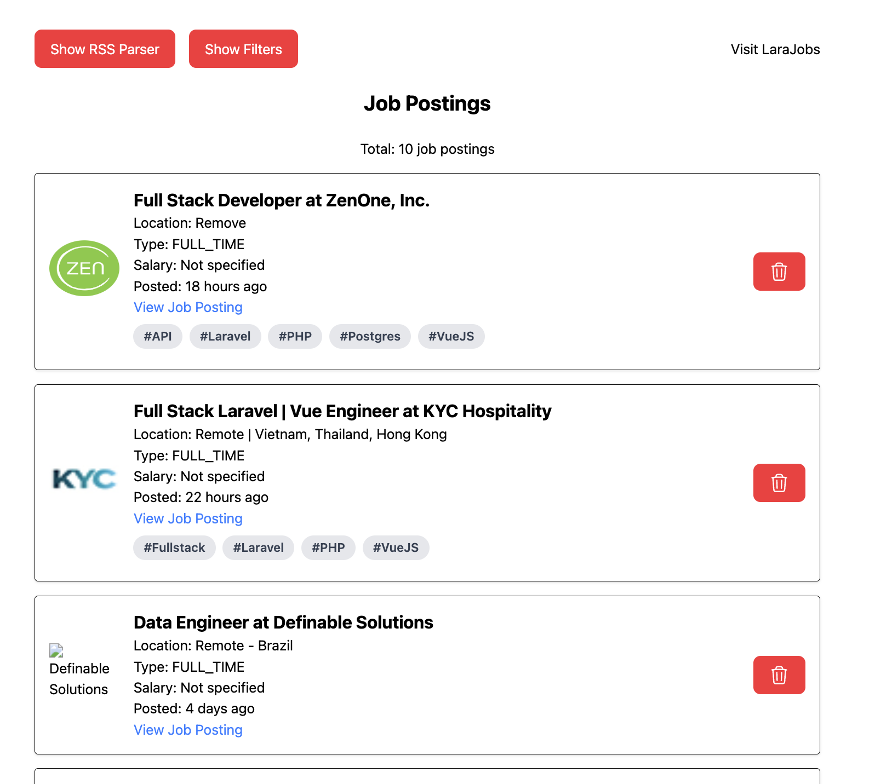

# LaraJobs Extra

A web app for parsing and filtering [LaraJobs.com](https://larajobs.com) RSS feed.

Built on [SvelteKit](https://svelte.dev/docs/kit/introduction).

For any bug reports or feature requests, visit the [issues](https://github.com/danielh-official/larajobs-extra/issues) page.

## Local Development

1. Clone: `git clone https://github.com/danielh-official/larajobs-extra.git`
2. Install packages: `pnpm install`
3. Run the server: `pnpm dev`

## Usage

1. Navigate to <https://larajobs.com/feed>
2. Copy and paste the XML data into the text area box (click "Show RSS Parser" if you don't see it)
3. Click "Parse RSS Content", and the job postings should show up
4. Click "Show Filters" to show the filtering box

## What should it look similar to?

## larajobs.com is down

If [larajobs.com](https://larajobs.com) is down, and you want to work on development, you may copy and paste the sample [feed.xml](./docs/feed.xml) file provided.

## Where is the data saved?

Data, inserted via the rss parser, is saved in your browser's local storage and indexed db.

There are plans to add functionality for a backend server, mainly for making fetch calls to larajobs.com for easier data import (fetch calls on the frontend are disallowed due to CORS-related restrictions). However, there are no plans to deploy this backend server to a live site.

Once the server functionality is added, if you wish to use fetch calls, you may clone the project and run your server locally as per the instructions under [Local Development](#local-development).
